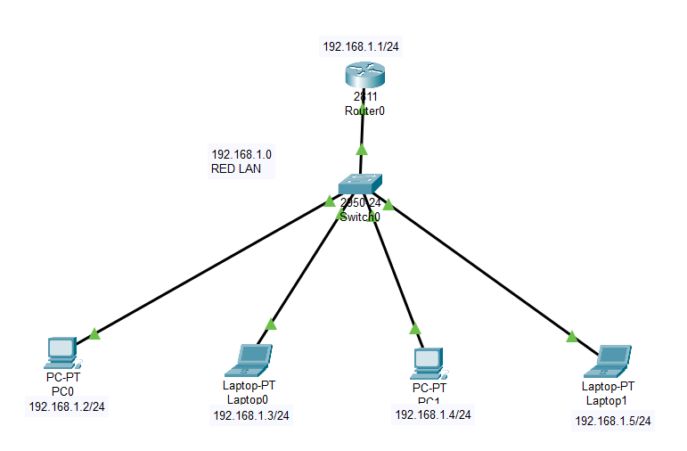

# practicas_redes
Prácticas asociadas con la implementación de infraestructuras de redes y la configuración de enrutamiento. Estas prácticas representan una simulación detallada de las actividades físicas realizadas en los laboratorios de la Universidad, como parte del curso de Fundamentos de Redes y Ruteo.

### Prácticas 1 Parcial
#### `Redes_Wi-Fi.pkt`:
Archivo generado en simulador Cisco Packet Tracert para la implementacion de una configuración mediante Wi-fi  WRT300N con las siguientes especificaciones:
* Configurar el dispositivo WRT300N
* Nombrar SSID Red LASALLE
* Habilitar seguridad mediante WPA
* Interconectar a la Red PC, Laptop y Smartphone

#### `Redes_Ethernet.pkt`:
Realizar la configuración de red cableada ethernet mediante un switch generic en simulador Cisco Packet Tracert con las siguientes especificaciones:
* Habilitar los puertos en el switch cap. 2
* Colocar direccionamiento IP Red Clase C.
* Agregar mínimo 6 nodos a la red.
* Publicar el archivo funcional generado por el Simulador Cisco Packet Tracert.
  

#### `Red_LAN_Router.pkt`:
Archivo generado en simulador Cisco Packet Tracert con las siguientes especificaciones:
* Configurar red LAN mediante un Router 2811 interconectado mediante un switch 2950-24 puertos.
* Red clase C 192.168.1.0
* Pegar 2 Workstations y 2 equipos Laptop mediante cable Ethernet.

#### `Red_Switch_Capa3.pkt`:
Crear una red ethernet interconectada mediante switch central Multilayer 3560 en simulador Cisco Packet Tracert con las siguientes especificaciones:
* Debe interconectar en la parte central de distribución de la red mediante 2 switches cap 2 , enlazados a un router wi-fi WRT300N. 
* Red Clase C en todo su direccionamiento. 
* Servidor principal con DNS - http.

#### `Examen_1Parcial.pkt`:
Configurar la siguiente Red en el simulador Cisco Packet Tracert.

### Prácticas 2 Parcial
#### `Red_LAN.pkt`:
Configurar la siguiente Red en el simulador Cisco Packet Tracert.

#### `Ruteo_Estatico.pkt`:
Archivo generado en simulador Cisco Packet Tracert con las siguientes especificaciones:
* Crear RED con 2 routers 1840 y 2 switches 2950 con 5 nodos clientes (R1 León, R2 Guanajuato)
* Deben conectarse y enviarse ping de extremo a extremo en segmentos diferentes y su default gateway.

#### `Avance_ProyectoFinal.pkt`:
Crear una propuesta de conexión de red para una empresa como entregable para el proyecto final.

#### `Examen_2P.pkt`:
Realizar la configuración del siguiente esquema de red según el escenario correspondiente:

### Prácticas 3 Parcial
#### `Ruteo_RIP_V2.pkt`:
Realizar la siguiente configuración de red mediante ruteo dinámico RIP V2 en simulador Cisco Packet Tracert deben comunicarse todos los nodos de extremo a extremo y centro.

#### `Ruteo_RIP_V2B.pkt`:
Configurar red mediante ruteo dinámico RIP V2 con el siguiente esquema de Red en Simulador Cisco Packet Tracert  Funcional.

